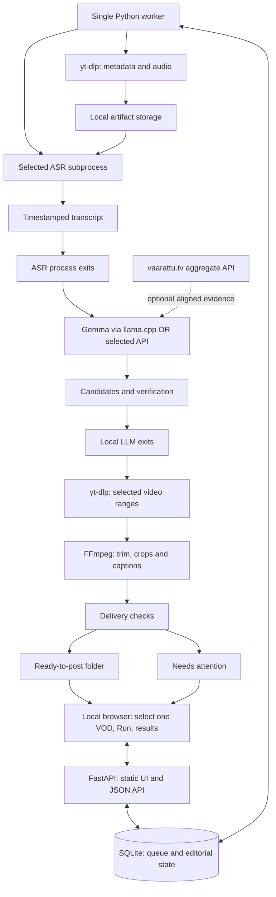

# Architecture

Status: implementation design. See [decisions](decisions.md) for rationale and [milestones](implementation-plan.md) for build order.

Implementation update: see [implementation-status.md](implementation-status.md) for the shipped subset and explicit differences. STT is Turbo only. All model assets and model-library caches reside under the repository's `.cache/`; the application has not been run on real models/media.

## System shape

One application package, two long-lived processes on this Windows PC: the web app and one worker. The worker owns finite subprocesses for downloads, FFmpeg and local model execution. Closing a browser tab does not stop work; restarting the worker resumes from completed artifacts.



No application worker runs inside a FastAPI request or `BackgroundTasks`. FastAPI's [background-task guidance](https://fastapi.tiangolo.com/tutorial/background-tasks/) distinguishes small request-adjacent work from heavy computation. Our queue also needs to survive process restarts.

Proposed package organization is deliberately small: `cli`, `web`, `worker`, `db`, `youtube`, `transcribe`, `discover`, `llm`, `stream_data`, `render`, `captions`, plus typed contracts and versioned SQL migrations. Do not create a generalized plugin framework or workflow engine. Share the same stage functions between CLI and worker.

## Persistence and artifact layout

Use stdlib SQLite with foreign keys, WAL and short transactions. Both processes open their own connections. No DB transaction spans model inference or network I/O. SQLite WAL permits readers alongside a writer but still has one writer and requires local shared-memory access; keep the DB off network shares and live cloud-sync folders. See [SQLite WAL](https://sqlite.org/wal.html).

Proposed durable records:

| Record | Minimum stored information |
|---|---|
| `vod` | YouTube ID (unique), pinned channel ID, raw title, upload timestamp, parsed recording-date hint, duration, availability, discovery order |
| `analysis_run` | VOD, overall state, selected ASR and local/API model profile snapshot, output root, input hashes, runtime/prompt/config revisions, stage coverage, timestamps |
| `job` | stage, run/candidate revision, idempotency key, state, attempts, next retry, owner/lease, progress and error class |
| `artifact` | kind, contained relative path, bytes/hash, producer job, source interval/time mapping, validation result |
| `stream_match` | VOD/stream IDs, evidence, identity status, independently versioned timeline mapping and confirmation |
| `candidate` | run, source anchor IDs and interval, Finnish summary/title, judgments, reasons/flags, speaker status and its evidence basis |
| `clip_revision` | candidate, edited bounds, caption corrections, layout revision, parent revision, ready/held/superseded state |
| `feedback` | clip revision, keep/reject reason or manually published marker, created time |

Store the word-rich transcript in JSONL, not thousands of hand-managed DB updates. The database indexes its manifest and segments needed by the UI. Persist model responses privately beside each run for diagnosis; the DB need only reference them. Do not store raw chat text for this integration.

```text
.cache/models/                  # pinned model assets, always inside this project
.cache/huggingface/              # project-local model-library cache
.cache/tools/                   # suggested external runtime location
workdir/                        # ignored project-local runtime/output root
  state.sqlite3
  cache/audio/<youtube_id>/
  cache/sections/<artifact_id>/
  runs/<run_id>/                 # manifests, transcript, requests/results
  clips/<clip_id>/<revision>/    # edit recipe, captions, previews
  ready/<clip_id>/<revision>/    # completed delivery package only
  ready/runs/<run_id>.json       # completed run index referencing its clip packages
  needs-attention/               # references/manifests for held outputs
  tmp/<job_id>/<attempt>/
  logs/
  backups/
```

Opaque IDs form filenames. Titles are display metadata; a YouTube ID may contain underscores. Never reconstruct IDs by splitting a decorated filename. Transcripts, decisions, edit recipes and exported files are durable. Downloads and scratch PCM are explicitly rebuildable caches.

The output root defaults to `workdir/ready/` and is selected through trusted local configuration before Run. A completed run index records VOD identity, coverage/outcome, ready package paths and held/rejected counts, including zero-output runs. The UI opens this directory and filters results to that run. If output is on another volume, stage promotion on that destination volume to preserve atomic rename. Do not expose a general arbitrary-path write API.

## Fixed pipeline and recovery

VOD stages: metadata → audio → transcript → ASR unload → discovery → candidate verification → LLM unload → selected section acquisition → alignment → render → QC → delivery. The worker advances automatically after each successful checkpoint. Optional caption refinement adds the serialized phase in [models-and-providers.md](models-and-providers.md). Stream enrichment is optional and can run after metadata; its outage produces an unavailable status, not a failed transcript pipeline. Candidate outcomes are independent within the same VOD, but expensive stages remain serial initially. A held candidate does not block other eligible clips from delivery.

**Initial admission invariant: at most one queued or active VOD run.** Enforce this in a short database transaction, not only by disabling a button. Double-clicks return the existing run through an idempotency key; a competing new VOD receives a conflict with the active run ID. Paused/interrupted/retryable runs retain the slot until resumed or explicitly cancelled. Terminal completed/failed/cancelled runs release it after owned work has stopped. Internal stage jobs do not count as additional VODs. Retry resumes the existing run; configuration changes create an explicit new run only after the previous run releases the slot. Closing the page or restarting the app never queues the next channel video.

Job states: `queued`, `running`, `succeeded`, `retry_wait`, `failed`, `cancelled`. Product exceptions such as `needs_layout`, `needs_alignment`, `needs_context` and `no_candidates` are explicit outcomes, not endless retry states. Overall VOD completion records scanned/failed intervals: partial coverage cannot be presented as a complete scan with no good moments.

1. Acquire an OS-owned singleton lock for the resolved workdir before starting the worker loop. A second worker exits with the existing worker's status; process death releases the lock, so a stale PID file cannot permanently block startup. In one short transaction claim a queued job, increment its attempt and set an owner/lease. Enforce a unique stage/input/config key so repeated clicks cannot duplicate work.
2. Do work in an attempt-specific directory, updating progress/heartbeat. Start external tools with argument arrays, no shell, hidden windows, bounded stdout/stderr and process ownership.
3. Validate and hash completed artifacts, then rename them into immutable locations on the same volume. Commit the artifact references and success state with the current ownership token.
4. On startup reconcile expired leases and incomplete attempts. Reuse only outputs whose manifest, hash and producing fingerprint match. An orphaned final artifact can be verified/adopted; a partial file is never a success marker.
5. Retry transient network/rate-limit failures at most three attempts with backoff and `Retry-After`. Invalid model output gets one schema repair, not unlimited editorial retries. Auth/access errors, invalid inputs and disk exhaustion require attention or a changed condition.

Cancellation terminates owned process trees, releases GPU resources and preserves completed stages. Fence completion writes from cancelled or obsolete attempts. For Windows use owned process handles/Job Object cleanup where needed; do not kill every process named `ffmpeg` or `llama-server` on the PC.

Editing a caption rerenders that clip, not the VOD transcript. Changing crop presets invalidates affected renders. Changing the discovery prompt creates a new analysis run and retains prior edits/feedback. Changing ASR creates new anchor IDs; old clip revisions continue to reference their original transcript and absolute source bounds.

## GPU and resource policy

The measured hardware is i7-13700K (16 cores/24 threads), RTX 4090 (24,564 MiB as reported), 63.8 GiB RAM. This is a capable baseline, not a throughput guarantee.

- One local GPU model family resident at a time: finish/checkpoint the selected VOD's ASR, terminate its owned process and await exit, then load the LLM for all discovery/verification requests. Terminate the LLM before rendering or any optional caption-refinement ASR reload. Python garbage collection alone is not proof of unloading. Hold models across adjacent requests within their stage to avoid per-window startup overhead. Use an application-specific cross-process Windows named mutex for the full resident session as well as the workdir singleton, so separate clipper workdirs cannot bypass serialization. Other applications do not share this lock; available-VRAM checks and pause controls still matter.
- Prefer Gemma 4 31B Q4 for the first quality/fit experiment and compare 26B-A4B Q4. Start at 16K context and one request slot, no vision projector or MTP; test 32K independently. Target full GPU residency and record actual layers/memory. Model file size alone does not prove fit. See the [model profiles](models-and-providers.md).
- Observe available VRAM before starting. Wait or adjust ASR batching through a recorded profile on OOM; do not silently switch models, enable CPU offload or call an API. Report the selected runtime/profile and a recoverable fit failure. An owned model process that failed to exit blocks the next model load.
- Start with serial media stages and one downloader. CPU-rendered H.264 is the reference output; benchmark NVENC as an optional faster profile. Pause should prevent new GPU-heavy stages promptly.
- Manual start/pause is v1. A later application-owned idle/overnight schedule can process a bounded backlog. This planning pass does not create a scheduled task.

## Local web UI

The first deliverable has a small Run page: paste/select one channel VOD, show hydrated title/duration, choose ASR profile and local LLM or configured API provider/model, select a calibrated layout/output location, then press **Run**. For API mode show the configured budget and estimate. Settings are snapshotted into the run. A known source/layout profile enables normal unattended delivery; initial calibration is setup, not a mandatory per-clip approval step. Do not require manual clicks for transcription, discovery or rendering.

While work runs, disable new-VOD admission and show stage/progress, pause/resume/cancel and completed clips. Reopening the page restores the same run. Completion shows ready files, held reasons or a valid zero-clips result, plus **Open output folder**. It does not automatically select another video. Initial selection can be a pasted URL and saved recent single-VOD entries; a complete channel library is unnecessary.

Later UI polish adds these views without changing the single-VOD limit:

1. **Runs and processing:** recent selected videos, duration, scanned coverage, chat availability, current stage, progress, pause/retry and estimated remaining work based on measured rates. The newest-first channel library arrives with the later backlog milestone.
2. **Candidates and clip detail:** original audio/source preview, vertical result, before/after context, editable start/end handles, word captions, crop rectangles and the concise selection reason. Show `Chat unavailable` or `Timing unconfirmed` separately from a low chat score.
3. **Ready folder:** completed shorts, faithful Finnish title, source link/date, open folder, optional keep/reject/correct and manually mark published. Held clips have a specific fix action.

Use standard HTML video/audio controls and small JS for trim/crop/caption edits, with 2-second status polling only while processing. Serve media by opaque artifact ID with byte-range support. Persist edits before enqueueing rerenders and return a revision ID; stale saves receive a conflict response. Captions/source text render as text, not HTML. Initial operator UI copy can be English; Finnish is the caption/title language. If localization is introduced, use one i18n structure for all supported locales.

Planned API groups are `/api/vods`, `/api/runs`, `/api/jobs`, `/api/candidates`, `/api/clips`, `/api/layouts`, `/api/artifacts/{id}` and `/api/status`. `POST /api/runs` admits one validated VOD and returns 202 plus run ID; polling returns durable stage/outcome state. Stage jobs are internal, not separate buttons required to finish the pipeline. Provider availability exposes only configuration/capability status, never keys. Do not expose arbitrary file paths or general-purpose download URLs.

Bind to `127.0.0.1`; verify Host/Origin and use a local mutation token. Keys and raw diagnostics stay out of the browser and logs. Private remote access later should put the same app behind an authenticated private tunnel/VPN, not expose an unauthenticated worker port. Hosting the UI elsewhere would require a new job/artifact transport and is not part of the first design.

## Storage, budget and observability

Observed free space at planning time: C: about 356.5 GiB; E: about 3,868.2 GiB. These are snapshots. Proposed C:-local defaults: 100 GiB maximum rebuildable cache and stop new media work below 30 GiB free. Check expected temporary space before every job; a cache cap does not cap durable exports or model storage.

Keep source audio for active runs and for 14 days after successful analysis, subject to least-recently-used eviction. Keep downloaded sections for active edits, then 7 days after successful delivery. Pinned work and any artifacts needed by active jobs cannot be evicted. On reopening an old clip, explicitly reacquire missing source sections. If the upstream VOD disappears, report unavailability; exported shorts and transcript provenance remain.

Back up SQLite through its backup API plus transcripts, recipes, feedback and ready artifacts with a manifest; copying only the live `.sqlite3` file is insufficient. Verify a restore into a separate directory before relying on backups.

Record per-stage elapsed time, processed media seconds, downloaded bytes, transcript coverage, model input/output/reasoning tokens, billed cost/estimate, candidate counts, ready yield, retry reason and peak VRAM when observable. Never claim a precise time/cost estimate from missing telemetry. Free disk, selected profile and spend cap should be visible before Run. Budget behavior and provider-specific capabilities are defined in [models-and-providers.md](models-and-providers.md).
